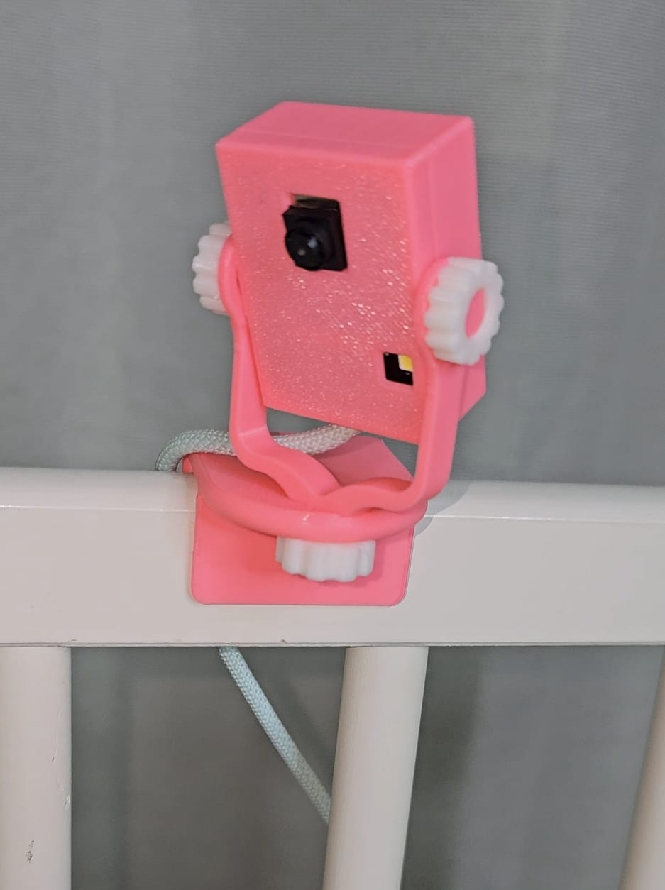

# Baby Monitor with ESP32-CAM

---

This project is a **Baby Monitor** system built using the ESP32-CAM module. It provides a live video feed and allows you to control the flashlight remotely via a web interface. The design is simple, mobile-friendly, and easy to use, making it perfect for monitoring your baby.

## Features

- **Live Video Streaming:** View the live video feed from the ESP32-CAM over your local network.
- **Remote Flashlight Control:** Toggle the built-in LED flash on and off from the web interface.
- **Mobile-Friendly Interface:** The web interface is designed to work seamlessly on both desktop and mobile devices.

## Table of Contents

- [Installation](#installation)
- [Usage](#usage)
- [Hardware Setup](#hardware-setup)
- [Web Interface](#web-interface)
- [Troubleshooting](#troubleshooting)
- [License](#license)

## Installation

### 1. Clone the Repository

\`\`\`bash
git clone https://github.com/yourusername/baby-monitor-esp32cam.git
cd baby-monitor-esp32cam
\`\`\`

### 2. Upload the Code to the ESP32-CAM

- Open the project in the Arduino IDE.
- Select the correct board (`ESP32 Wrover Module`) and the correct COM port.
- Enter your Wi-Fi credentials in the `ssid` and `password` variables.
- Upload the code to the ESP32-CAM.

## Usage

1. **Power on your ESP32-CAM.**
2. **Connect to the same Wi-Fi network** as the ESP32-CAM.
3. **Open a web browser** and enter the IP address shown in the Serial Monitor.
4. Use the web interface to view the live stream and control the flashlight.

## Hardware Setup

### Components Used

- **ESP32-CAM Module**
- **LED Flash (built-in)**
- **Power Supply (5V)**

### Wiring

| ESP32-CAM Pin | Component          | Note                             |
|---------------|--------------------|----------------------------------|
| GPIO 4        | LED Flash (built-in)| Controls the flashlight          |

## Web Interface

The web interface is designed to be simple and responsive, allowing you to monitor your baby from any device. The interface includes:

- **Live Video Feed:** Displays the live stream from the camera.
- **Toggle Flashlight Button:** Allows you to turn the flashlight on or off.
- **Flashlight Status Indicator:** Shows whether the flashlight is currently on or off.

## Troubleshooting

- **No Video Feed:** Ensure that the ESP32-CAM is properly connected to your Wi-Fi network and that the IP address is correct.
- **Flashlight Not Working:** Check the wiring and ensure that the GPIO pin is correctly configured.

## License

This project is licensed under the MIT License - see the [LICENSE](LICENSE) file for details.
